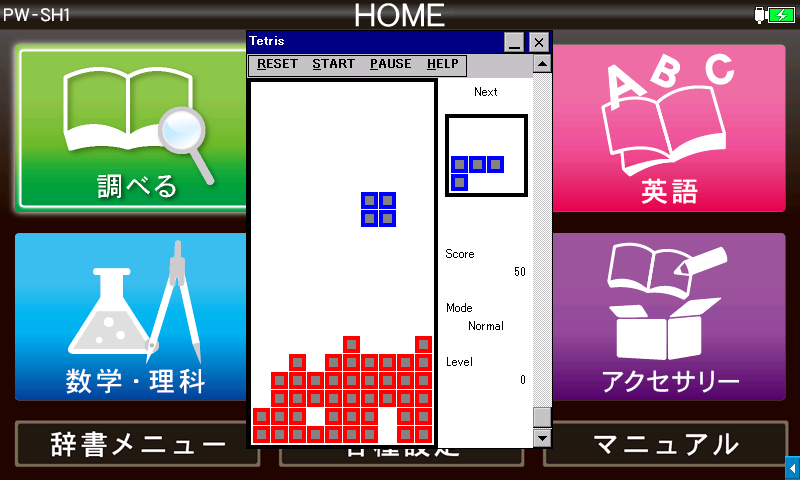

# tetris by Yuri213212

[English](README.md) / **中文** / [日本語](README-JP.md)



使用协议：对于所有文件遵循 [CC BY-NC-SA 4.0](https://creativecommons.org/licenses/by-nc-sa/4.0/)

本程序模仿简单的液晶屏俄罗斯方块掌机。

## 系统要求

- **Windows 2000 或更高版本**
  - 已在 Windows XP SP3、10、11 上测试
- **Windows CE .NET 4.0 或更高版本**
  - 已确认可用于 [Sharp Brain PW-SH1](https://jp.sharp/support/dictionary/product/pw-sh1.html) (CE 6.0 with Armv5TEJ CPU), [Sigmarion III](https://www.hpcfactor.com/hardware/devices/141/NTT_Do_Co_Mo/Sigmarion_III) (CE 4.1 with Armv4 CPU), [MobilePro 900](https://www.hpcfactor.com/hardware/devices/134/NEC/MobilePro_900) (CE 4.2 with Armv5TE CPU) 
  - 完整播放需要 480px（高）x 320px（宽）或更高的屏幕分辨率

有关 Sharp Brain（包括兼容型号）的信息，请参阅 [Brain Wiki](https://brain.fandom.com/ja)。

## 方块种类

- 简单模式：7 种常规方块
  ```
  　　。　　　　　　　　　　　　　　　　　　　　　　　　　　　　　　　　
  　　。　　　　。。　　　。　　　　　。　　　　　　　　　　　　　　　　
  　　。　　　　。。　　　。　　　　　。　　。。。　　　。。　　。。　　
  　　。　　　　　　　　　。。　　　。。　　　。　　　。。　　　　。。　
  ```
- 困难模式：在简单模式基础上增加 6 种方块，其中 1 点的会穿墙
  ```
  　　　　　　　　　　　　　　　　　　　　　　　　　　　　　　
  　　　　　　　。　　　。。。　　　。。　　。。　　　　　　　
  　。。。　　。。。　　　。　　　　。　　　　。　　　　。　　
  　。　。　　　。　　　　。　　　。。　　　　。。　　　　　　
  ```
- 欢乐模式：在困难模式基础上增加 3 种特殊道具，从左到右依次是消块枪、加块枪和炸弹
  ```
  　　　　　　　。　　　。　　。
  　　。　　　　。　　　　。。　
  　　。　　　　。　　　　。。　
  　　　　　　　　　　　　　　　
  ```

## 颜色的意义

- 红色：场上的方块
- 蓝色：普通方块
- 绿色：可以穿墙的方块
- 黄色：正在穿墙的方块
- 紫色：特殊道具
- 橙色：炸弹爆炸特效
- 青色：消块枪的子弹，高速下落，从下方出界消失，落到红色块将与其同时消失
- 黑色：加块枪的子弹，高速下落，落地将变成红色块

## 操作方法

从 [Releases](../../releases) 下载合适的版本，并在设备上运行。无需安装。您可以直接删除此应用程序。它不会保存任何外部信息，如注册表。

对于 Sharp Brain，请使用 Armv4I 或 Armv5TEJ，[此处（日文）](https://brain.fandom.com/ja/wiki/%E3%82%A2%E3%83%97%E3%83%AA%E3%81%AE%E8%B5%B7%E5%8B%95%E6%96%B9%E6%B3%95)或[此处（英文）](https://www.hpcfactor.com/reviews/editorial/ceopener-sharp-brain/)。 不过，由于必须在高分辨率模式下运行，请放置 `AppMain.cfg` 或通过 exeopener 或 ceOpener 等其他软件启动。

- 游戏开始前，按方向键选择模式和等级
  - 上下键选择模式，决定游戏中可能出现的方块类型
  - 左右键选择等级，决定初始盘面下方出现随机垃圾的行数
- 按“开始”按钮或回车键开始游戏
- 按方向键控制游戏
  - 左右键水平移动方块
  - 下键向下移动方块（加速下落）
  - 上键逆时针旋转方块，不过特殊道具不能旋转，上键用于执行道具的特殊动作
    - 对于消块枪和加块枪，上键发射与其对应的子弹，两种枪落地消失
      - 屏幕中的子弹数量限制为 1，主要是减少程序复杂性，同时避免了动画过程中插入动画的可能性
    - 对于炸弹，上键立即引爆，如果不按则是落地时引爆，爆炸中心为其田字中心，破坏 6\*6 区域的方块
- 按“暂停”按钮或空格键暂停游戏
- 按“重启”按钮或 Esc 键重启游戏机
- 使用滚动条或上下翻页/Home/End 键调节音量

## 关于声音

- 因为是模拟简单的游戏机，所以只做了单通道方波，处理简单，不过设计爆炸等音效的乐谱比较困难
- 单方波令人联想到超市收银台、医院心电图等只能发出 500Hz 方波的业务机器，因此调音的时候故意调成 A-4=500 Hz 而不是标准的 440 Hz
- 开机音乐出自 9999 in 1 游戏机，游戏开始与结束音乐出自只有俄罗斯方块的游戏机，都是凭记忆重现，可能与实机有区别

## 如何构建

### 为 Windows PC 构建

- `tetris.sh`：在 UNIX 上使用 [MinGW-w64](https://www.mingw-w64.org/) 联编二进制文件
  - 要求可从 PATH 访问 MinGW-w64
  - 您可能需要传递指向正确 MinGW-w64 二进制文件的环境变量 `PREFIX32` 和 `PREFIX64`，因为环境不同（例如 `x86_64-w64-mingw32-`）

### 为 Windows CE（包括 Sharp Brain）构建

您可能需要先阅读[此处（日语）](https://brain.fandom.com/ja/wiki/%E9%96%8B%E7%99%BA%E7%92%B0%E5%A2%83%E3%83%BBSDK)或[此处（英语）](https://www.hpcfactor.com/developer/)来设置您的开发环境。

- `brain.sh`：在 UNIX 上使用 [CeGCC](https://max.kellermann.name/projects/cegcc/) 生成二进制文件
  - 要求可从 PATH 访问 CeGCC
  - 如果想使用不同版本的 CeGCC，可以通过环境变量 `PREFIX`
- `evc4proj/`：eMbedded Visual C++ 4.0 项目
  - 只需打开 `.vcw` 文件，并在安装了 SDK 的 Windows 机器上构建即可
  - 我们使用 Windows CE 4.0 标准 SDK
