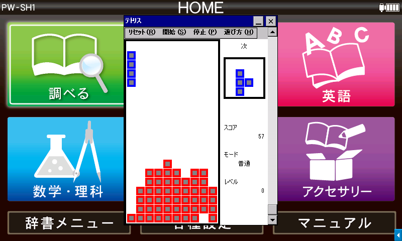

# tetris by Yuri213212

[English](README.md) / [中文](README-CH.md) / **日本語**



ライセンス：[CC BY-NC-SA 4.0](https://creativecommons.org/licenses/by-nc-sa/4.0/)

簡易的なテトリスの携帯ゲーム機を再現します。

## 動作環境

- **Windows 2000 以降**
  - Windows XP SP3, 10, 11 で動作確認済み
- **Windows CE .NET 4.0 以降**
  - [SHARP Brain PW-SH1](https://jp.sharp/support/dictionary/product/pw-sh1.html) (CE 6.0 with Armv5TEJ CPU), [Sigmarion III](https://www.hpcfactor.com/hardware/devices/141/NTT_Do_Co_Mo/Sigmarion_III) (CE 4.1 with Armv4 CPU), [MobilePro 900](https://www.hpcfactor.com/hardware/devices/134/NEC/MobilePro_900) (CE 4.2 with Armv5TE CPU) で動作確認済み
  - 完全なプレイには縦 480px 横 320px 以上の画面解像度が必要です

SHARP Brain について、対応機種等の情報は [Brain Wiki](https://brain.fandom.com/ja) を参考にしてください。日本語で使用する場合は電子辞書の日本語化が必要です。

## テトリミノの種類

- 普通：7 種類
  ```
  　　。　　　　　　　　　　　　　　　　　　　　　　　　　　　　　　　　
  　　。　　　　。。　　　。　　　　　。　　　　　　　　　　　　　　　　
  　　。　　　　。。　　　。　　　　　。　　。。。　　　。。　　。。　　
  　　。　　　　　　　　　。。　　　。。　　　。　　　。。　　　　。。　
  ```
- 難しい：壁を通り抜ける 1 点テトリミノを含む 6 種類のテトリミノを追加
  ```
  　　　　　　　　　　　　　　　　　　　　　　　　　　　　　　
  　　　　　　　。　　　。。。　　　。。　　。。　　　　　　　
  　。。。　　。。。　　　。　　　　。　　　　。　　　　。　　
  　。　。　　　。　　　　。　　　。。　　　　。。　　　　　　
  ```
- ファン：左からブロック消し銃、ブロック銃、ボムの 3 つの特殊小道具が追加
  ```
  　　　　　　　。　　　。　　。
  　　。　　　　。　　　　。。　
  　　。　　　　。　　　　。。　
  　　　　　　　　　　　　　　　
  ```

## 色

- 赤：フィールド上のブロック
- 青：通常のブロック
- 緑：壁を通り抜け可能なブロック
- 黄：壁を通り抜けているブロック
- 紫：特殊な小道具
- 橙：爆弾の爆発エフェクト
- 水：ブロック消し銃からの弾丸
  - 高速で落下し、境界線の下から消え、赤いブロックに着地するとそのブロックとともに消える
- 黒：ブロック銃の弾
  - 高速で落下し、地面に当たると赤いブロックに変わる

## 遊び方

[Releases](../../releases) からご使用のコンピュータに合った実行ファイルを取得し、実行します。インストール作業は不要です。アンインストールも、レジストリ等は使用しないので実行ファイルを削除するだけで可能です。

SHARP Brain では Armv4I または Armv5TEJ のものを使用し、[こちら](https://brain.fandom.com/ja/wiki/%E3%82%A2%E3%83%97%E3%83%AA%E3%81%AE%E8%B5%B7%E5%8B%95%E6%96%B9%E6%B3%95)に記載の手順に従ってください。ただし、高解像度モードでの実行が必要なため、`AppMain.cfg` を配置するか exeopener や ceOpener 等の他ソフト経由で起動してください。

- ゲーム開始前に、矢印キーでモードとレベルを選択できます
  - 上下キーでモードを選択し、ゲームに登場するテトリミノの種類を決めます
  - 左右キーでレベルを選択し、最初に盤面下部に配置されるランダムなブロックの列数を決めます
- 開始ボタンまたは Enter キーを押すとゲームが始まります
- 矢印キーで操作します
  - 左右キーでテトリミノを水平に移動します
  - 下キーでテトリミノを下に移動（加速）します
  - 上キーでテトリミノを反時計回りに回転させます
    - 特殊小道具は回転せず、特殊動作を行います
    - ブロック消し銃とブロック銃：上キーで弾を発射（地面に落ちると消える）
      - アニメーション処理中に別のアニメーションが発生することを防ぎ、プログラムの複雑さを軽減するために画面上の弾丸の個数は 1 つまでに制限されています
    - 爆弾：上ボタンを押すとすぐに爆発し、そうでない場合は地面に落ちたときに爆発し、爆発の中心はそのフィールドの中心となり、6x6 エリアを破壊する
- 停止またはスペースキーを押すと停止します
- リセットまたは ESC キーを押すとゲームがリセットします
- スクロールバーまたは Page Up/Page Down/Home/End キーで音量を調節できます

## サウンドについて

簡易ゲーム機の再現なので 1 ch の矩形波のみで構成されており、扱いは簡単ですが、爆発音などの効果音の作曲が難しくなります。スーパーのレジや病院の心電図のような 500 Hz の矩形波しか出せない業務用機械を想起させるよう、標準的な 440 Hz ではなく A-4 = 500 Hz にチューニングしています。起動時の音楽は「9999 in 1」ゲーム機のもの、開始時と終了時の音楽は「テトリス」専用ゲーム機のものですが、いずれも記憶から再現しているため、実機とは異なる可能性があります。

## ビルド方法

### Windows PC 向けにビルドする

- `tetris.sh`: [MinGW-w64](https://www.mingw-w64.org/) を用いてビルドします（UNIX 環境向け）
  - MinGW-w64 に PATH が通っている必要があります
  - 環境によっては環境変数 `PREFIX32` と `PREFIX64` を設定する必要があります（例：`x86_64-w64-mingw32-`）

### Windows CE（SHARP Brain を含む）向けにビルドする

まず、[こちら](https://brain.fandom.com/ja/wiki/%E9%96%8B%E7%99%BA%E7%92%B0%E5%A2%83%E3%83%BBSDK)を参考に環境構築を行ってください。

- `brain.sh`: [CeGCC](https://max.kellermann.name/projects/cegcc/) を用いてビルドします（UNIX 環境向け）
  - CeGCC に PATH が通っている必要があります
  - 環境変数 `PREFIX` を設定し、異なるバージョンの CeGCC を使用することも可能です
- `evc4proj/`: eMbedded Visual C++ 4.0 プロジェクト
  - SDK がインストールされた状態の Windows 環境で `.vcw` ファイルを開き、ビルドします
  - Release は Standard SDK for Windows CE 4.0 で作成しています
