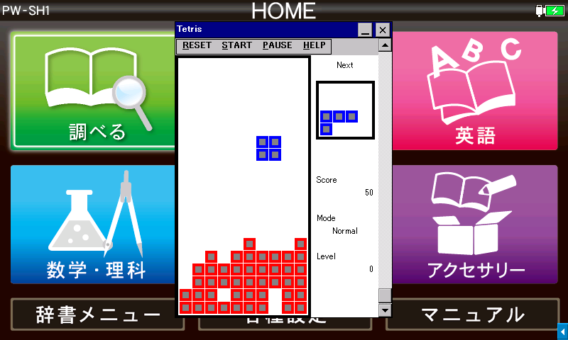

# tetris by Yuri213212

**English** / [中文](README-CH.md) / [日本語](README-JP.md)



License: [CC BY-NC-SA 4.0](https://creativecommons.org/licenses/by-nc-sa/4.0/)

This program mimics a simple LCD Tetris handheld.

## Supported Platforms

- **Windows 2000 or later**
  - Tested on Windows XP SP3, 10 and 11
- **Windows CE .NET 4.0 or later**
  - Tested on [Sharp Brain PW-SH1](https://jp.sharp/support/dictionary/product/pw-sh1.html) (CE 6.0 with Armv5TEJ CPU), [Sigmarion III](https://www.hpcfactor.com/hardware/devices/141/NTT_Do_Co_Mo/Sigmarion_III) (CE 4.1 with Armv4 CPU), [MobilePro 900](https://www.hpcfactor.com/hardware/devices/134/NEC/MobilePro_900) (CE 4.2 with Armv5TE CPU)
  - A screen resolution of at least 480px x 320px (H x W) is required for a complete playing experience

Read [Brain Wiki](https://brain.fandom.com/ja) for supported Sharp Brain electronic dictionary devices.

## Tetriminos

- Normal mode: 7 regular Tetriminos
  ```
  　　。　　　　　　　　　　　　　　　　　　　　　　　　　　　　　　　　
  　　。　　　　。。　　　。　　　　　。　　　　　　　　　　　　　　　　
  　　。　　　　。。　　　。　　　　　。　　。。。　　　。。　　。。　　
  　　。　　　　　　　　　。。　　　。。　　　。　　　。。　　　　。。　
  ```
- Hard Mode: Adds 6 types of Tetriminos to Easy Mode, includes a Tetrimino which consists of just 1 dot which goes through walls
  ```
  　　　　　　　　　　　　　　　　　　　　　　　　　　　　　　
  　　　　　　　。　　　。。。　　　。。　　。。　　　　　　　
  　。。。　　。。。　　　。　　　　。　　　　。　　　　。　　
  　。　。　　　。　　　　。　　　。。　　　　。。　　　　　　
  ```
- Fun Mode: 3 special props are added to the hard mode, from left to right, they are Block Elimination Gun, Block Gun, and Bomb
  ```
  　　　　　　　。　　　。　　。
  　　。　　　　。　　　　。。　
  　　。　　　　。　　　　。。　
  　　　　　　　　　　　　　　　
  ```

## Colors

- Red: Blocks on the field
- Blue: Normal blocks
- Green: Blocks that go through walls
- Yellow: Blocks that are going through walls
- Purple: Special props
- Orange: Bomb explosion effects
- Cyan: Bullets from block elimination guns
  - Falls at high speed, disappears from the bottom of the border, and will disappear with a red block when it lands on it
- Black: Bullets from block guns
  - Falls at high speed, will turn into a red block when it hit the ground

## Playing

Download an appropriate one from [Releases](../../releases) and run it on your device. No installation needed. You can remove this app by just deleting it. It doesn't save anything outside such as the registry.

For Sharp Brain, use Armv4I or Armv5TEJ version and follow the usual procedure, which is explained [here (Japanese)](https://brain.fandom.com/ja/wiki/%E3%82%A2%E3%83%97%E3%83%AA%E3%81%AE%E8%B5%B7%E5%8B%95%E6%96%B9%E6%B3%95) and [here (English)](https://www.hpcfactor.com/reviews/editorial/ceopener-sharp-brain/). Then, place `AppMain.cfg` or launch from another app such as exeopener or ceOpener, to run this game in the full resolution mode.

- Before the game starts, press the arrow keys to select a mode and a level
  - Press up and down keys to select a mode, which determines the set of Tetriminos that may appear in the game
  - Press left and right keys to select a level, which determines the number of rows of randomized garbage blocks that will appear at the bottom of the playing field
- Press "START" or the Enter key to start the game
- Use arrow keys to control Tetriminos
  - Left and right button to move Tetriminos horizontally
  - Down key to move Tetriminos downward (accelerates the fall)
  - Up key to rotate Tetriminos counterclockwise
    - Special props doesn't rotate, but performs special moves defined for each props instead
    - For block elimination guns and block guns, press up to fire a bullet, and both guns will disappear when they hit the ground
      - The number of bullets in the screen is limited to 1, mainly to reduce the complexity of the implementation introduced by the possibility of inserting an animation during another animation process
    - For bombs, the up button will detonate it immediately, if you don't press it, it will detonate when it hits the ground, the center of the explosion will be the center of the field, destroying the 6x6 area
- Press "PAUSE" or the Space key to pause the game
- Press "RESET" or the Esc key to restart the game
- Use the scroll bar or Page Up/Page Down/Home/End keys to adjust the volume

## About Sound

As this software simulates a simple game console, it plays square wave in single channel which is easy to handle. However, it makes designing scores for explosions and other sound effects difficult. The single channel square wave is reminiscent of business machines that can only emit 500 Hz square waves such as supermarket cash registers and hospital EKGs, so the tuning was deliberately set to A-4 = 500 Hz instead of the standard 440 Hz. The start-up music is from a game console named "9999 in 1", and the start and end musics are from a Tetris-only game machine, both of which are reproduced from our memory and may be different from the actual sound.

## How To Build

### Build for Windows PC

- `tetris.sh`: Builds executables using [MinGW-w64](https://www.mingw-w64.org/) on UNIX
  - Requires MinGW-w64 to be accessible from PATH
  - You may need to pass environmental variables `PREFIX32` and `PREFIX64` that points to correct MinGW-w64 executables, as it differs by environments (ex. `x86_64-w64-mingw32-`)

### Build for Windows CE (including Sharp Brain)

You probably want to read either [here (Japanese)](https://brain.fandom.com/ja/wiki/%E9%96%8B%E7%99%BA%E7%92%B0%E5%A2%83%E3%83%BBSDK) or [here (English)](https://www.hpcfactor.com/developer/) to set up your development environment first.

- `brain.sh`: Builds executables using [CeGCC](https://max.kellermann.name/projects/cegcc/) on UNIX
  - Requires CeGCC to be accessible from PATH
  - You can pass a environmental variable `PREFIX` if you want to use a different version of CeGCC
- `evc4proj/`: eMbedded Visual C++ 4.0 project
  - Just open the `.vcw` file and build on a Windows machine, with a SDK installed
  - We use the Standard SDK for Windows CE 4.0
